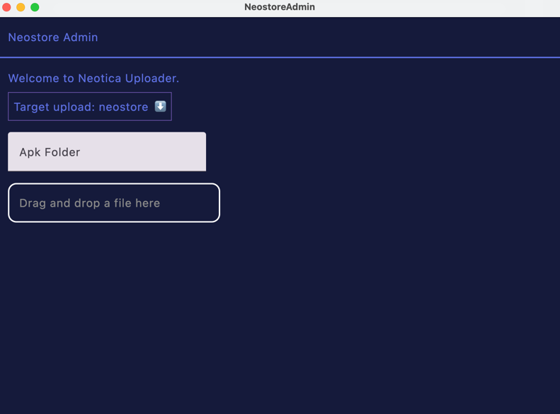

# Neomart Admin Dashboard

I use this as a gateway to upload apk(s) to the Neostore app.
The backend is still underway and actively developed (when I have the time).

The goal of this project is to provide a universal application repository that can be easily accessible in a form of online store (mimicking Google Play Store/Apple App Store) for legacy devices.

The targeting apps that will be distributed via Neostore will be of those that supports legacy devices (Android 1.x - 4.x).