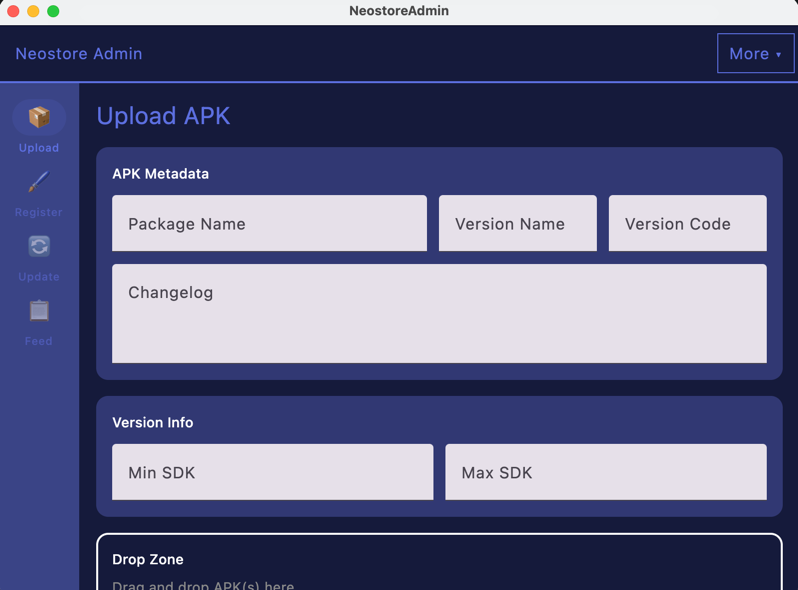
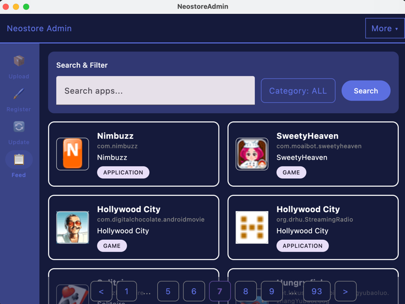
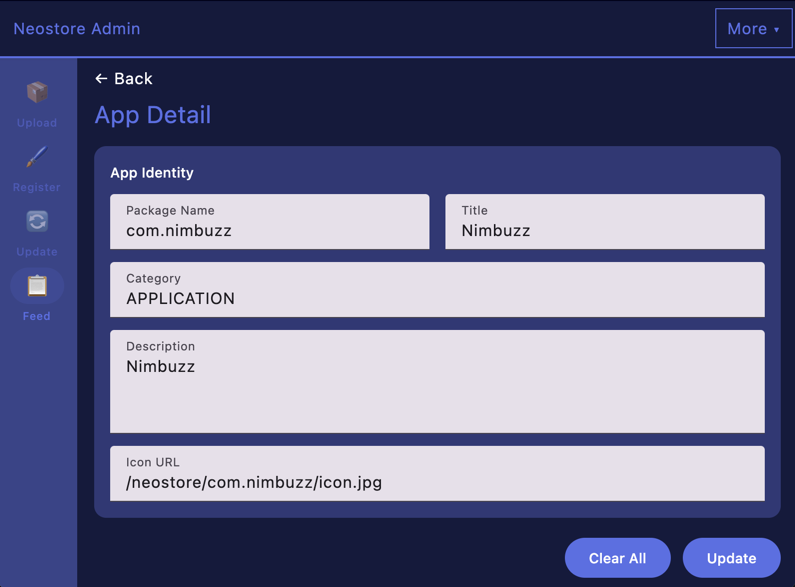

# Neomart Admin Dashboard

Desktop GUI for uploading and managing APKs in the Neostore ecosystem. Built with Compose Multiplatform (JVM).

## Screenshots

| Upload                         | Feeds                        | App Detail                            |
|--------------------------------|------------------------------|---------------------------------------|
|  |  |  |

## Features

### Upload
- **Drag-and-drop** — Drop APK files directly from the OS file explorer.
- **Client-side parsing** — Automatically extracts package name, version, and SDK targets from `AndroidManifest.xml` before upload.
- **Bulk queue** — Add multiple APKs; processed sequentially with per-file status tracking.
- **Smart upload** — Multipart form for files < 50 MB, direct byte streaming for larger files.
- **Auto-registration** — If the app isn't registered yet, the app auto-registers it and uploads the icon before publishing.

### Manage
- **Feed** — Browse all registered apps with search, category filtering, and paginated grid view.
- **Detail** — View and edit app metadata (title, description, category, icon URL).
- **Update** — Modify app identity fields and republish.

### Auth
- **JWT login** — Credentials sent via request headers, token stored via Java Preferences API.

## Tech Stack

- **UI** — Compose Multiplatform (Desktop / JVM), Material 3
- **Architecture** — MVVM with unidirectional `StateFlow` data flow
- **DI** — Koin
- **Networking** — Ktor Client (CIO engine, bearer auth, `kotlinx.serialization`)
- **APK parsing** — `net.dongliu:apk-parser`
- **Image loading** — Coil 3 with Ktor network fetcher
- **Config** — Gmazzo BuildConfig plugin (compile-time URL injection from `local.properties` / env vars)
